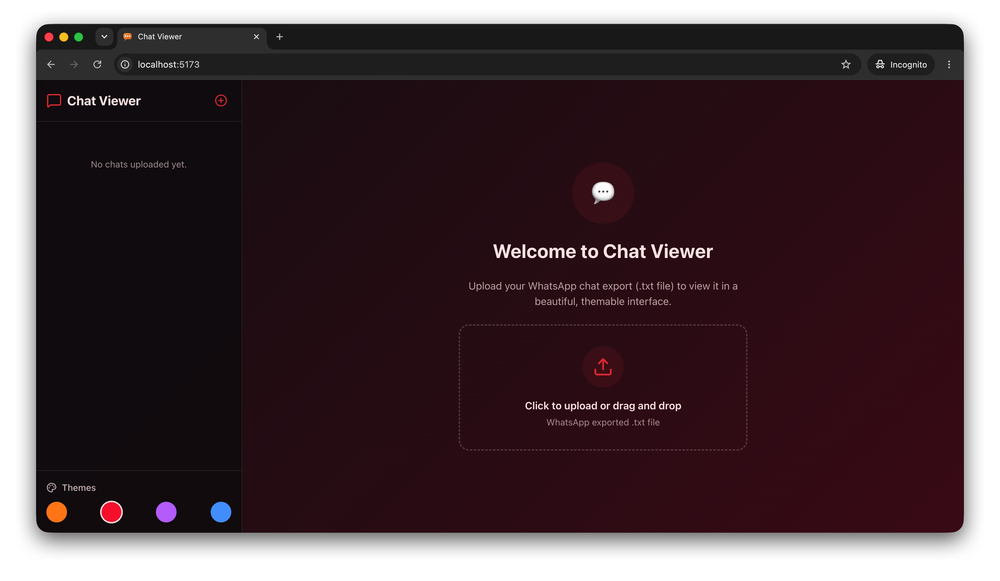
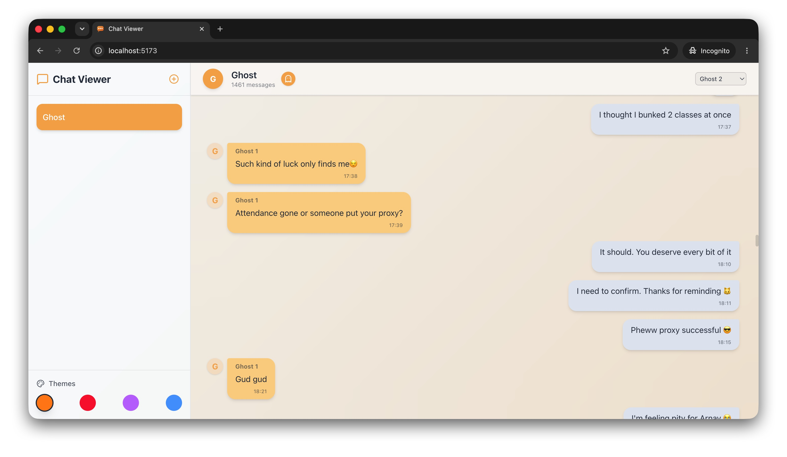
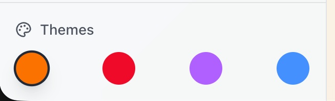

# 💬 Chat Viewer

A beautifully crafted, highly performant React application built to parse, visualize, and customize WhatsApp chat exports right in your browser. 

Designed with a premium aesthetic and rich interactions, Chat Viewer transforms plain text backups into an engaging, chronological chat interface.

---

## 📸 Screenshots

<div align="center">
  
  <br/>
</div>

<br/>

<div align="center">
  
  
  <br/>
  <em>(Left) Ghost Mode protecting user privacy. (Right) Theme switcher panel.</em>
</div>

---

## ✨ Features

- **⚡️ High-Performance Rendering:** Built with chunked rendering to handle massive, multi-year WhatsApp `.txt` exports without breaking a sweat or dropping frames.
- **🎨 Premium Theming:** Four exquisite, gradient-powered themes built using CSS Variables and Tailwind CSS v4:
  - **Friends** ☕️ (Warm and cozy)
  - **Spicy** 🌶 (Dark, intense reds)
  - **Besties** 🦄 (Vibrant, playful purples)
  - **Family** 🌊 (Calm, organized blues)
- **👻 Anonymous "Ghost" Mode:** A one-click toggle to instantly anonymize the chat title and all participant names for secure, private viewing.
- **🖼 Custom Display Pictures:** Don't like the default initials? Simply click on any user's profile picture bubble to upload a custom DP for them.
- **🗂 Multi-Chat Management:** Upload multiple `.txt` files and seamlessly switch between different conversations using the sidebar.
- **💾 Persistent State:** Your active chats, chosen theme, and uploaded display pictures are automatically saved to `localStorage`. You'll never lose your setup upon refreshing!

## 🚀 Tech Stack

- **Framework:** [React 19](https://react.dev/) powered by [Vite](https://vitejs.dev/)
- **Styling:** [Tailwind CSS v4](https://tailwindcss.com/) for fluid, utility-first design
- **Icons:** [Lucide React](https://lucide.dev/) for crisp, beautiful SVG icons
- **State Management:** Native React Context + `localStorage` synchronization

## 💻 Getting Started

### Prerequisites
Make sure you have [Node.js](https://nodejs.org/) installed on your machine.

### Installation

1. **Clone the repository:**
   ```bash
   git clone <your-repo-url>
   cd CSV2Chat
   ```

2. **Install dependencies:**
   ```bash
   npm install
   ```

3. **Start the development server:**
   ```bash
   npm run dev
   ```

4. **Open in browser:**
   Navigate to `http://localhost:5173` to see the application running.

## 📱 How to Use

1. Export a chat from WhatsApp (without media) as a `.txt` file.
2. Drag and drop the `.txt` file into the Chat Viewer upload zone.
3. Use the **dropdown in the header** to select "Who you are", aligning your messages to the right.
4. Click on the theme circles at the bottom left to change the vibe.
5. Click the **Ghost icon** 👻 in the header to enter anonymous mode.
6. Click on a chat bubble's profile initial to upload a custom picture!

---
*Built with ❤️ by Sid*
